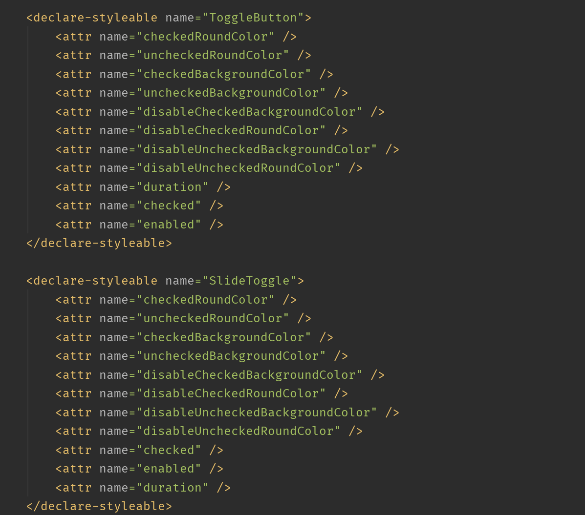

  
### Preview

<div align=center></div>

### Usage

1. Add it in your **root**  `build.gradle` at the end of repositories

```groovy
allprojects {
	repositories {
		...
		maven { url 'https://jitpack.io' }
	}
}
```

2. Add the dependency


```groovy
dependencies {
    ...
    implementation 'com.github.ijkzen:ToggleButton:<latest_version>'
}
```

### Practice

0. Example

```xml
<com.github.ijkzen.ToggleButton
        android:id="@+id/toggle2"
        android:layout_centerHorizontal="true"
        android:layout_below="@id/toggle"
        android:layout_marginTop="30dp"
        app:enable="true"
        app:enableBackgroundColor="@android:color/holo_red_light"
        app:enableRoundColor="@android:color/holo_green_light"
        app:disableBackgroundColor="@android:color/holo_green_light"
        app:disableRoundColor="@android:color/holo_red_light"
        android:layout_width="120dp"
        android:layout_height="70dp"/>
```


1. Use `attributes` on xml



2. Set `attributes` programmatically

```kotlin
    fun setBackgroundEnableColor(@ColorRes color: Int) {
        mEnableBackgroundColor = color
        invalidate()
    }

    fun setBackgroundDisableColor(@ColorRes color: Int) {
        mDisableBackgroundColor = color
        invalidate()
    }

    fun setRoundEnableColor(@ColorRes color: Int) {
        mEnableRoundColor = color
        invalidate()
    }

    fun setRoundDisableColor(@ColorRes color: Int) {
        mDisableRoundColor = color
        invalidate()
    }

    fun setEnable(enable: Boolean) {
        if (enable != mIsEnable) {
            mIsEnable = !mIsEnable
            mIsChanged = true
            mTouchUpTime = System.currentTimeMillis()
            invalidate()
        }
    }

    fun isEnable() = mIsEnable

    fun toggle() {
        setEnable(!mIsEnable)
    }

    fun setDuration(duration: Int) {
        mDuration = if (duration < 300) {
            300
        } else {
            duration
        }
    }
```

### More

If you have any questions, please ask me [here](https://github.com/ijkzen/ToggleButton/issues)
