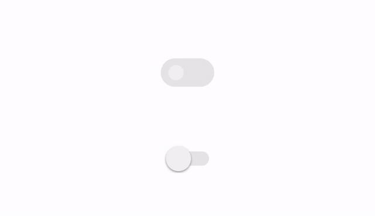

### Preview



### Usage

1. Add it in your **root**  `build.gradle` at the end of repositories

```groovy
allprojects {
	repositories {
		...
		maven { url 'https://jitpack.io' }
	}
}
```

2. Add the dependency

```groovy
dependencies {
    ...
    implementation 'com.github.ijkzen:ToggleButton:releasev1.0.0'
}
```

### Practice

1. Use `attributes` on xml


2. Set `attributes` programmatically

```kotlin
    fun setBackgroundEnableColor(@ColorRes color: Int) {
        mEnableBackgroundColor = color
        invalidate()
    }

    fun setBackgroundDisableColor(@ColorRes color: Int) {
        mDisableBackgroundColor = color
        invalidate()
    }

    fun setRoundEnableColor(@ColorRes color: Int) {
        mEnableRoundColor = color
        invalidate()
    }

    fun setRoundDisableColor(@ColorRes color: Int) {
        mDisableRoundColor = color
        invalidate()
    }

    fun setEnable(enable: Boolean) {
        if (enable != mIsEnable) {
            mIsEnable = !mIsEnable
            mIsChanged = true
            mTouchUpTime = System.currentTimeMillis()
            invalidate()
        }
    }

    fun isEnable() = mIsEnable

    fun toggle() {
        setEnable(!mIsEnable)
    }

    fun setDuration(duration: Int) {
        mDuration = if (duration < 300) {
            300
        } else {
            duration
        }
    }
```

### More

If you have any questions, please ask me [here](https://github.com/ijkzen/ToggleButton/issues)